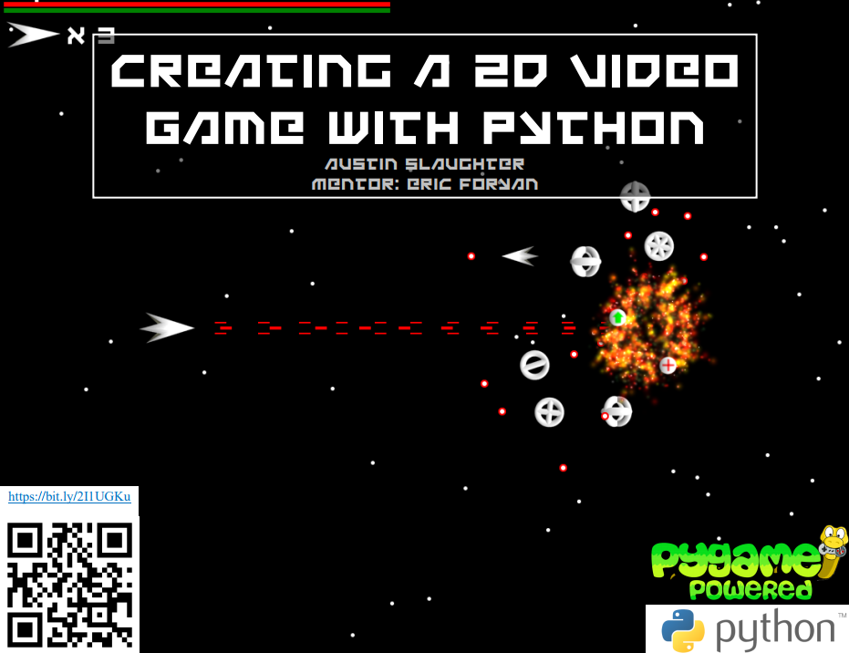

## [Click here for install instructions!](https://github.com/slaugaus/seniorproject/wiki/Install-Instructions)  

# Austin Slaughter's Senior Project  
Proof of Austin Slaughter's senior project, "Making a 2D Video Game with Python."  
  
### Credits:  
Sound effects obtained from https://www.zapsplat.com  
Font is "Uno Estado" by Dan Zadorozny (Iconian Fonts)  

"Space Fighter Loop"  
Kevin MacLeod (incompetech.com)  
Licensed under Creative Commons: By Attribution 3.0  
http://creativecommons.org/licenses/by/3.0/
